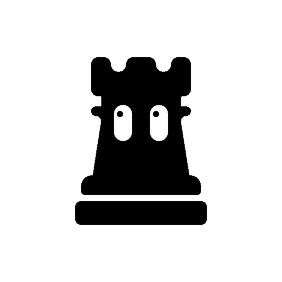

<div align="center">

<picture>
  <source media="(prefers-color-scheme: dark)" srcset=".github/assets/rook-mascot-dark.gif">
  
</picture>

# homebrew-rook

**The official Homebrew tap for [rook](https://github.com/LambdaTest/rook)** — agent assurance from the terminal.

[](https://github.com/LambdaTest/homebrew-rook/actions/workflows/brew-smoke.yml)
[](https://github.com/LambdaTest/homebrew-rook/actions/workflows/test-scripts.yml)
[](https://www.npmjs.com/package/@testmuai/rook)
[](LICENSE)

</div>

## Install

```bash
brew install lambdatest/rook/rook
```

Homebrew adds the tap automatically on a fresh installation.

> [!IMPORTANT]
> Install by the full `lambdatest/rook/rook` name, not just `rook`. Homebrew refuses to load a formula from a third-party tap by its short name until the tap is trusted, and naming the tap in full is what satisfies that automatically. `brew install rook` after the same tap fails with `Error: Refusing to load formula lambdatest/rook/rook from untrusted tap lambdatest/rook.`

## Upgrade and uninstall

```bash
brew upgrade lambdatest/rook/rook       # rook update prints this command for Homebrew installs
brew uninstall lambdatest/rook/rook
brew untap lambdatest/rook              # after uninstalling, to remove the tap as well
```

## What you get

- **A self-contained `rook`.** The formula bundles its own Node runtime, so nothing on your machine needs Node.
- **Bottles** for arm64 macOS 15 (Sequoia) and x86_64 Linux. Older macOS versions and Intel Macs build from source, which needs Homebrew's `node` at build time only.
- **Stable releases only.** Pre-release versions of rook are published to npm, not to this tap.

### If you tapped before the formula moved here

Until September 2026 the formula lived in `LambdaTest/rook` itself and was tapped by explicit URL. That clone keeps pulling from the old remote, and its history is unrelated to this repository's, so re-point it and put it on the new history in one go. The installed `rook` is untouched:

```bash
brew tap --custom-remote lambdatest/rook https://github.com/LambdaTest/homebrew-rook
git -C "$(brew --repository lambdatest/rook)" reset --hard origin/main
```

> [!WARNING]
> Two paths that look shorter do not work on Homebrew 6. `brew update` alone after the first command tries to rebase the old history onto the new one and leaves the tap detached mid-rebase. `brew untap --force` uninstalls `rook` before removing the tap.

## Getting help

rook is developed and supported in [LambdaTest/rook](https://github.com/LambdaTest/rook). Report install problems there with [an issue](https://github.com/LambdaTest/rook/issues/new/choose), and include `brew config` and the failing command's output.

<div align="center">
<br>
<sub>Licensed under <a href="LICENSE">Apache 2.0</a>, the same as rook · Made by <a href="https://www.testmuai.com">TestMu AI</a> (formerly LambdaTest)</sub>
</div>
